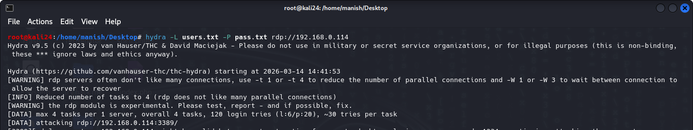
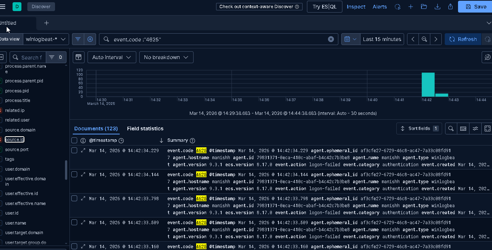
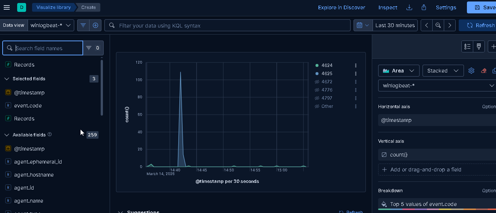
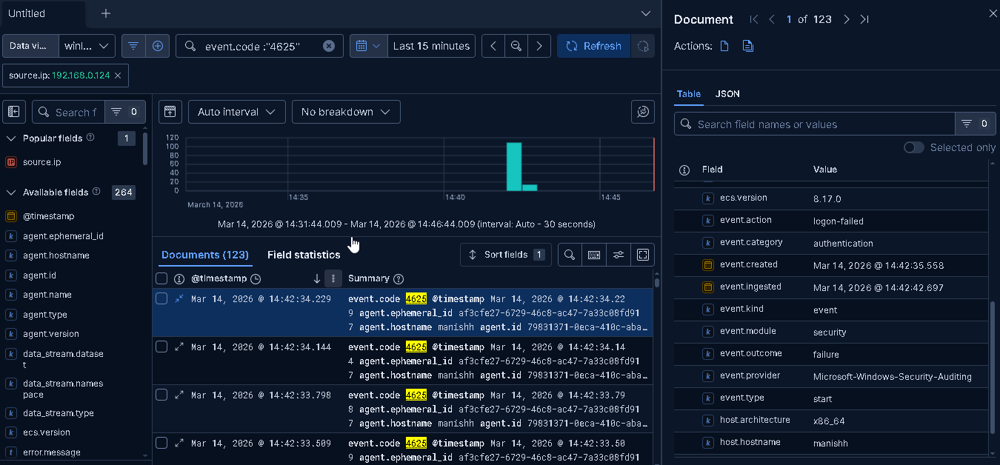
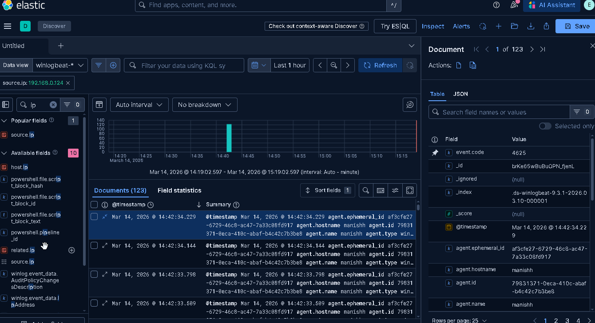
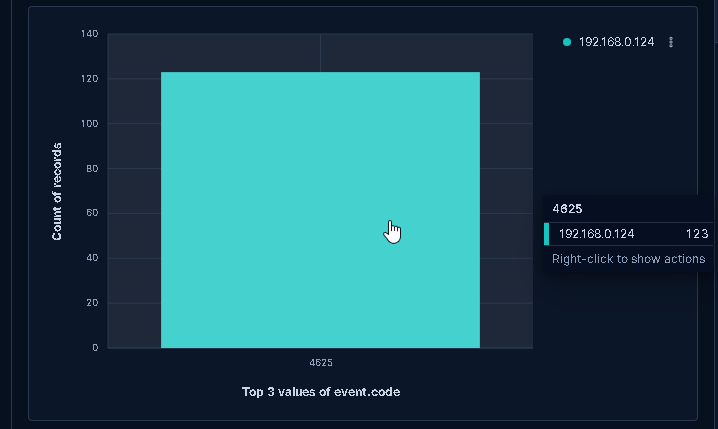
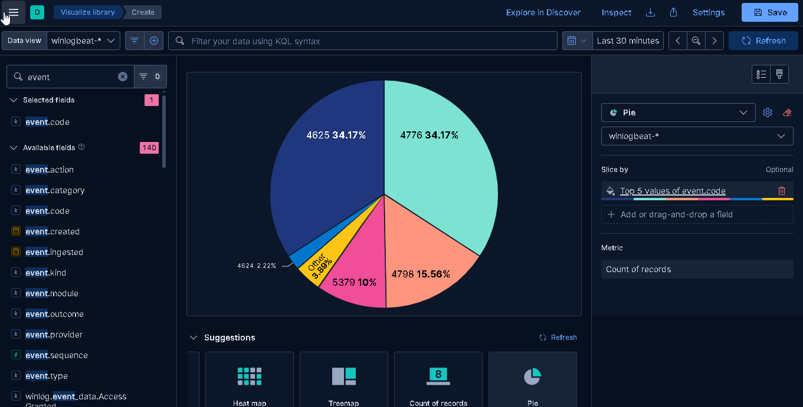

# 🔴 RDP Brute Force Attack Detection Using ELK Stack


---

> A hands-on Blue Team home lab project simulating an RDP brute force attack using **Hydra on Kali Linux** and detecting it in real-time using **Winlogbeat + ELK Stack** on a Windows victim machine.

---

## 📌 Table of Contents

- [Project Overview](#-project-overview)
- [Lab Architecture](#-lab-architecture)
- [Tools & Technologies](#-tools--technologies)
- [Phase 1 — Attack Simulation (Kali Linux)](#phase-1--attack-simulation-kali-linux)
- [Phase 2 — Windows Audit Configuration](#phase-2--windows-audit-configuration)
- [Phase 3 — Winlogbeat Setup](#phase-3--winlogbeat-setup)
- [Phase 4 — Detection on Kibana](#phase-4--detection-on-kibana)
- [Phase 5 — MITRE ATT&CK Mapping](#phase-5--mitre-attck-mapping)
- [Phase 6 — Detection Rule](#phase-6--detection-rule)
- [Key Findings](#-key-findings)
- [Screenshots](#-screenshots)
- [Blue Team Response](#-blue-team-response)
- [Connect](#-connect)

---

## 📖 Project Overview

**Remote Desktop Protocol (RDP)** exposed on port `3389` is one of the most commonly abused entry points by attackers. In this project, I:

- Simulated a real-world **RDP brute force attack** using Hydra from Kali Linux
- Shipped Windows Security Event Logs to **Elasticsearch** using Winlogbeat
- Detected and analyzed the attack in **Kibana** using KQL queries and visualizations
- Mapped the attack to **MITRE ATT&CK** framework
- Built a **threshold-based detection rule** in Kibana SIEM

---

## 🏗 Lab Architecture

```
┌─────────────────────────┐         RDP Brute Force          ┌──────────────────────────────┐
│   Kali Linux            │ ───────────────────────────────► │  Windows (Victim)            │
│   IP: 192.168.0.124     │         Port: 3389               │  IP: 192.168.0.114           │
│   Tool: Hydra v9.5      │                                   │  Hostname: manishh           │
│   users.txt + pass.txt  │                                   │  Winlogbeat + ELK Stack      │
└─────────────────────────┘                                   └──────────────────────────────┘
                                                                         │
                                                              ┌──────────▼──────────┐
                                                              │   Elasticsearch     │
                                                              │   Index: winlogbeat-*│
                                                              └──────────┬──────────┘
                                                                         │
                                                              ┌──────────▼──────────┐
                                                              │   Kibana Dashboard  │
                                                              │   KQL + Lens Charts │
                                                              └─────────────────────┘
```

| Component | Details |
|-----------|---------|
| Attacker OS | Kali Linux — IP: `192.168.0.124` |
| Victim OS | Windows — IP: `192.168.0.114`, Hostname: `manishh` |
| Attack Tool | Hydra v9.5 |
| Log Shipper | Winlogbeat Agent v9.3.1 |
| ECS Version | 8.17.0 |
| SIEM | Elasticsearch + Kibana |
| Network | Host-Only / Internal (VirtualBox) |

---

## 🛠 Tools & Technologies

| Tool | Purpose |
|------|---------|
| **Kali Linux** | Attacker machine |
| **Hydra v9.5** | RDP brute force simulation |
| **Windows** | Victim machine with RDP enabled |
| **Winlogbeat v9.3.1** | Windows Security Event log shipper |
| **Elasticsearch** | Log storage and indexing |
| **Kibana** | Detection, visualization, SIEM |
| **MITRE ATT&CK** | Threat behavior mapping |

---

## Phase 1 — Attack Simulation (Kali Linux)

The attack was launched from Kali Linux using **Hydra**, targeting the Windows victim's RDP service on port 3389.

### Attack Command

```bash
hydra -L users.txt -P pass.txt rdp://192.168.0.114
```

| Flag | Description |
|------|-------------|
| `-L users.txt` | List of usernames to attempt |
| `-P pass.txt` | Password wordlist |
| `rdp://` | Target protocol — RDP on port 3389 |

### Attack Details

```
Start Time  : 2026-03-14 14:41:53
Target      : rdp://192.168.0.114
Total Tries : 120 login attempts (6 users × 20 passwords)
Tasks       : 4 parallel tasks (~30 tries per task)
Duration    : ~41 seconds (14:41:53 → 14:42:34)
```

> ⚠️ Hydra auto-reduced threads to 4 — RDP servers do not handle many parallel connections well.

### Screenshot — Attacker Terminal (Kali Linux)



---

## Phase 2 — Windows Audit Configuration

### Enable Advanced Audit Policy

```
gpedit.msc → Computer Configuration
          → Windows Settings
          → Security Settings
          → Advanced Audit Policy Configuration
          → Audit Policies
```

| Policy | Setting |
|--------|---------|
| Logon/Logoff → Audit Logon | ✅ Success + Failure |
| Logon/Logoff → Audit Account Lockout | ✅ Success + Failure |
| Account Logon → Audit Credential Validation | ✅ Success + Failure |

```cmd
gpupdate /force
```

### Key Windows Event IDs Monitored

| Event ID | Description | Relevance |
|----------|-------------|-----------|
| **4625** | Failed Logon | 🔴 Primary brute force indicator |
| **4624** | Successful Logon | 🟡 Successful RDP access |
| **4776** | NTLM Credential Validation | 🟠 Auth attempt tracking |
| **4798** | Local Group Membership Enumerated | 🟠 Post-access recon |
| **5379** | Credential Manager Read | 🔵 Credential harvesting |

> 🔑 **Key Filter:** RDP logins use **Logon Type 10 (RemoteInteractive)**. Always filter on this to isolate RDP-specific events.

---

## Phase 3 — Winlogbeat Setup

### winlogbeat.yml Configuration

```yaml
winlogbeat.event_logs:
  - name: Security
    event_id: 4624, 4625, 4648, 4776, 4798
    ignore_older: 72h

  - name: Microsoft-Windows-TerminalServices-RemoteConnectionManager/Operational
    ignore_older: 72h

output.elasticsearch:
  hosts: ["localhost:9200"]
  index: "winlogbeat-rdp-%{+yyyy.MM.dd}"

setup.kibana:
  host: "localhost:5601"

setup.ilm.enabled: false
setup.template.name: "winlogbeat"
setup.template.pattern: "winlogbeat-*"
```

### Install & Start Winlogbeat

```powershell
cd "C:\Program Files\Winlogbeat"

# Validate config
.\winlogbeat.exe test config -e

# Setup index template
.\winlogbeat.exe setup -e

# Install as Windows Service
.\install-service-winlogbeat.ps1

# Start service
Start-Service winlogbeat

# Verify
Get-Service winlogbeat
```

---

## Phase 4 — Detection on Kibana

### KQL Queries Used

```kql
# All failed logins
event.code: "4625"

# RDP-specific failed logins (Logon Type 10)
event.code: "4625" AND winlog.event_data.LogonType: "10"

# Filter by attacker IP
event.code: "4625" AND source.ip: "192.168.0.124"

# Failed + Successful (detect brute force success)
event.code: ("4624" OR "4625") AND winlog.event_data.LogonType: "10"
```

---

## 📸 Screenshots

### 1. Kibana Discover — 123 Failed Login Events (Event ID 4625)

> KQL: `event.code: "4625"` | Time range: Last 15 minutes | Result: **123 documents**



---

### 2. Area Chart — Attack Burst Timeline

> Lens Area Chart | Breakdown: Top 5 values of `event.code` | X-axis: `@timestamp` per 30 seconds



> 📌 The sharp spike at **14:40** represents the Hydra brute force burst — a classic automated attack signature.

---

### 3. Kibana Discover — Filtered by Attacker IP (source.ip: 192.168.0.124)

> Filter: `source.ip: 192.168.0.124` | Document panel confirms `event.action: logon-failed`, `event.outcome: failure`, `event.provider: Microsoft-Windows-Security-Auditing`



---

### 4. Kibana Discover — IP Field Inspection + Event Code Confirmation

> Field search: `ip` | Filter: `source.ip: 192.168.0.124` | Document panel confirms `event.code: 4625`



---

### 5. Bar Chart — Top 3 Values of Event Code by Source IP

> All 123 brute force events (event code **4625**) linked to a single source IP: `192.168.0.124` — confirming the attacker machine



> 📌 A single IP generating 123 failed logins in under a minute is a **definitive indicator of automated brute force activity**.

---

### 6. Pie Chart — Event Code Distribution

> Lens Pie Chart | Slice by: Top 5 values of `event.code` | Metric: Count of Records



| Event Code | % Share | Meaning |
|------------|---------|---------|
| **4625** | 34.17% | Failed Logon (brute force) |
| **4776** | 34.17% | NTLM Credential Validation |
| **4798** | 15.56% | Local Group Membership Enumerated |
| **5379** | 10.00% | Credential Manager Read |
| **4624** | 2.22% | Successful Logon |
| Other | 3.89% | Miscellaneous security events |

---

## Phase 5 — MITRE ATT&CK Mapping

| Tactic | Technique | ID | Description |
|--------|-----------|-----|-------------|
| Initial Access | Remote Services: RDP | **T1021.001** | Attacker targets exposed RDP port 3389 |
| Credential Access | Brute Force: Password Guessing | **T1110.001** | Hydra automated credential guessing |
| Credential Access | Brute Force: Password Spraying | **T1110.003** | Multiple usernames attempted |
| Defense Evasion | Valid Accounts | **T1078** | Goal: obtain valid credentials |

---

## Phase 6 — Detection Rule

A threshold-based rule was configured in **Kibana Security → Rules**:

```
Rule Name   : RDP Brute Force — Threshold Alert
Rule Type   : Threshold
Index       : winlogbeat-*
KQL Filter  : event.code: "4625" AND winlog.event_data.LogonType: "10"
Group By    : source.ip
Threshold   : >= 5 events
Time Window : 2 minutes
Severity    : High
MITRE ATT&CK: T1110.001 — Brute Force: Password Guessing
```

> This rule fires automatically when any single IP generates **5 or more failed RDP logins within 2 minutes**.

---

## 📊 Key Findings

```
Total Failed Logins    : 123 (Event ID 4625)
Attacker IP            : 192.168.0.124 (Kali Linux)
Target IP              : 192.168.0.114 (Windows Victim)
Attack Duration        : ~41 seconds  (14:41:53 → 14:42:34)
Total Combinations     : 120 (6 users × 20 passwords)
Logon Type             : 10 (RemoteInteractive = RDP)
Agent Hostname         : manishh
ECS Version            : 8.17.0
Event Provider         : Microsoft-Windows-Security-Auditing
```

---

## 🛡 Blue Team Response

| Priority | Action |
|----------|--------|
| 🔴 Immediate | Block attacker IP `192.168.0.124` at firewall |
| 🔴 Immediate | Enable Account Lockout Policy (lock after 5 failed attempts) |
| 🟠 Short-term | Restrict RDP to VPN/internal network only |
| 🟠 Short-term | Enable Network Level Authentication (NLA) |
| 🟡 Medium-term | Enforce MFA on all RDP-accessible accounts |
| 🟡 Medium-term | Document IOCs and open incident ticket (TheHive/Jira) |
| 🟢 Long-term | Deploy honeypot on port 3389 to track future attempts |

---

## 📁 Repository Structure

```
rdp-bruteforce-detection-elk/
│
├── README.md                        ← This file
├── winlogbeat.yml                   ← Winlogbeat configuration
│
└── screenshots/
    ├── bruteforce.png               ← Hydra attack from Kali Linux
    ├── 4625Elastic.png              ← Kibana Discover — 123 failed logins
    ├── areachart.png                ← Attack timeline area chart
    ├── category.png                 ← Kibana Discover filtered by source IP
    ├── dashboard.png                ← IP field inspection + event code view
    ├── ip_with_ec.png               ← Bar chart — Top 3 event codes by IP
    └── visulipie.png                ← Pie chart — event code distribution
```

---

## 🔗 Connect

| Platform | Link |
|----------|------|
| 💼 LinkedIn | [linkedin.com/in/manishravtole](https://linkedin.com/in/manishravtole) |
| 🐙 GitHub | [github.com/manishravtole](https://github.com/manishravtole) |
| 🔐 TryHackMe | [tryhackme.com/p/Cipher24](https://tryhackme.com/p/Cipher24) |

---

## ⚠️ Disclaimer

> This project was conducted in a **controlled home lab environment** for educational and research purposes only. All attack simulations were performed on machines I own. Do not use these techniques on systems you do not have explicit written permission to test.

---

*Made with 🔵 Blue Team mindset by Manish Ravtole*
